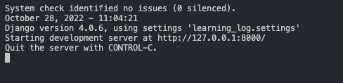
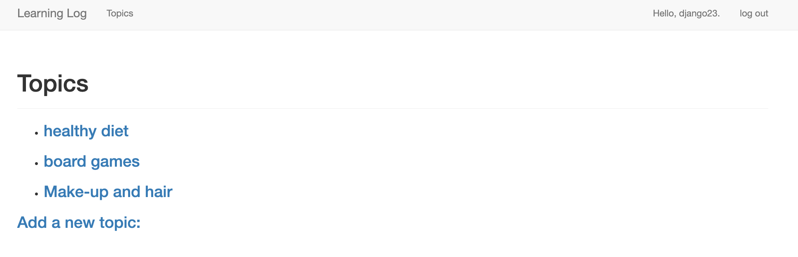

# Getting Started with Django

# Introduction
The purpose of this development is to learn how to use Django by building a project called Learning Log - an online journal system that helps you keep track of information for particular topics. This is an implementation of Django Web App from *Python Crash Course*.

# Test the app
- Create an environment in Python and install the dependencies (pip install -r requirements.txt)
- Run in terminal: python manage.py runserver
- From the pop-up terminal, press CTRL+click on the http undress -> 
- A link opens in browser and you either register or log in, if you already have an account
- Create Topics and add Entries for the topics you create -> 

